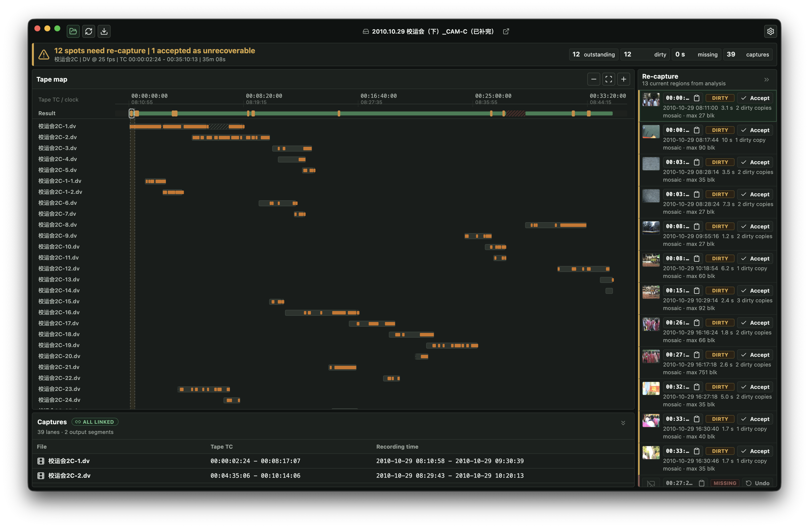

# TapeFlow

A cross-platform (Windows / Linux / macOS) desktop app for rescuing old **DV and HDV camcorder
tapes** — both formats in one interface. Capture a worn tape a few times, drop the files in, and
TapeFlow works out how they combine into one complete video and tells you exactly what's still
damaged.

## Why

Magnetic tape doesn't age gracefully. A worn DV or HDV tape rarely plays back cleanly from start to
finish in one pass — dropouts and mistracking leave glitches, and they fall in *different* places
each time the tape runs. So the way to rescue one is to capture it several times over: every pass is
a slightly different, slightly broken copy, but between them they tend to cover the whole tape, with
the clean frames simply scattered across different files.

Reassembling those passes into one good video by hand is the tedious part — for every damaged moment
you have to hunt down which capture happens to hold a clean copy, splice it in, and keep track of
whatever no pass managed to read at all. TapeFlow does that bookkeeping. Point it at your captures
and it tells you, at a glance, whether they already add up to a complete video — and if not, exactly
which spots still need another pass on the deck.

(It can't capture *for* you: modern computers no longer have the FireWire hardware to pull DV/HDV
off a tape, so you still capture on an old camcorder or deck and copy the files over. TapeFlow takes
it from there.)

## How it works

1. **Point it at a folder** of captures of one tape — several overlapping passes, each with some
   damage.
2. **Analyse.** TapeFlow lines the captures up on a tape-map and gives you a verdict: complete, or a
   list of the spots that still need re-capturing — each one labelled with the tape's **timecode**
   (to find it on the deck) and the camera's **recording time**.
3. **Re-capture those spots**, drop the new files in, and re-analyse. The list shrinks; you watch
   the map turn from red to green.
4. **Export** the finished, merged video.

## Download

Grab the latest build for your platform from the
[**Releases**](https://github.com/xingrz/tapeflow/releases) page:

- **macOS** — `.dmg` (pick `arm64` for Apple Silicon, `x64` for Intel Macs)
- **Windows** — `.exe` installer
- **Linux** — `.AppImage`

The builds aren't code-signed yet, so your OS will warn on first launch:

- **macOS** — recent macOS no longer lets right-click → **Open** bypass Gatekeeper for unsigned
  apps. After moving TapeFlow to your Applications folder, clear its quarantine flag once in
  Terminal: `sudo xattr -r -d com.apple.quarantine /Applications/TapeFlow.app`
- **Windows** — on the SmartScreen prompt, click **More info → Run anyway**.

You'll also need a tool or two on your PATH — see [Requirements](#requirements).

## Requirements

The app bundles everything it needs except a couple of external command-line tools, which must be on
your PATH:

- **[dvrescue](https://mediaarea.net/dvrescue)** (MediaArea/MIPoPS) — required for DV tapes.
- **[ffmpeg](https://ffmpeg.org/)** — recommended; it powers HDV damage detection and the
  damaged-frame previews.

## Built on

TapeFlow doesn't reinvent the merge — it's a graphical front-end to two existing, open-source
command-line engines, and it orchestrates and visualises what they do:

- **hdvmerge** — the HDV / Sony MPEG-TS merge engine — https://github.com/xingrz/hdvmerge
- **dvmerge** — DV, built on the `dvrescue` tool — https://github.com/xingrz/dvmerge

## Development

An Electron + Vue front-end over a Python engine, with the two merge engines pinned in as git
submodules. To hack on it: clone recursively (`git clone --recursive …`), then `cd app && npm
install && npm run dev`. The architecture, data contract, and engine mechanics are in
[AGENTS.md](AGENTS.md).

## License

[MIT](LICENSE) © XiNGRZ. The bundled engines [hdvmerge](https://github.com/xingrz/hdvmerge) and
[dvmerge](https://github.com/xingrz/dvmerge) are MIT too.
